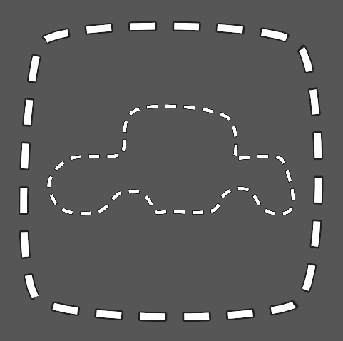

# Unity Dashed (Dotted) Sprite Shape

This is a small example project that demonstrates creating dashed (dotted) 2D Sprite Shapes in Unity using a custom shader and the **2D SpriteShape** package. It's tested on Unity 2019.4.26f1 with built-in render pipeline, URP/HDRP isn't tested. The idea is based on [this Twitter post](https://twitter.com/avashly/status/1237510975831429121) but the shader is slightly different.

